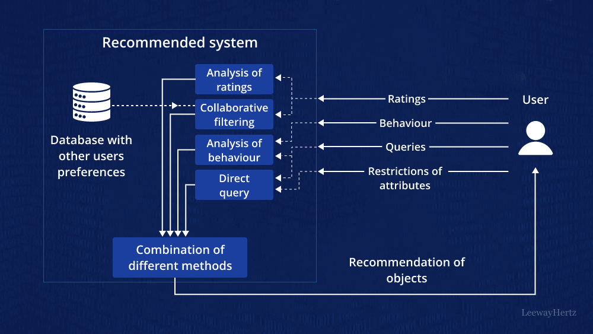
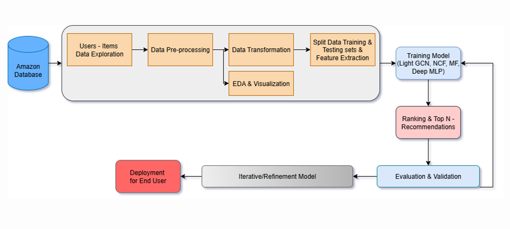
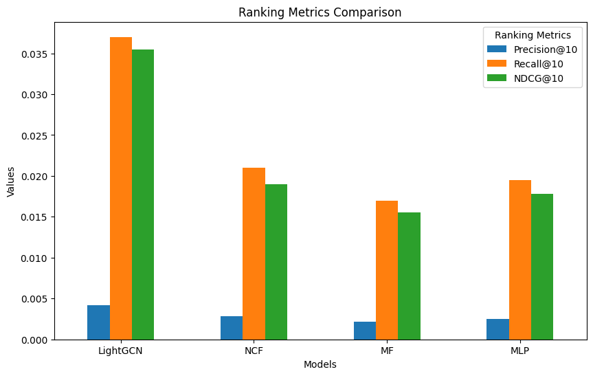
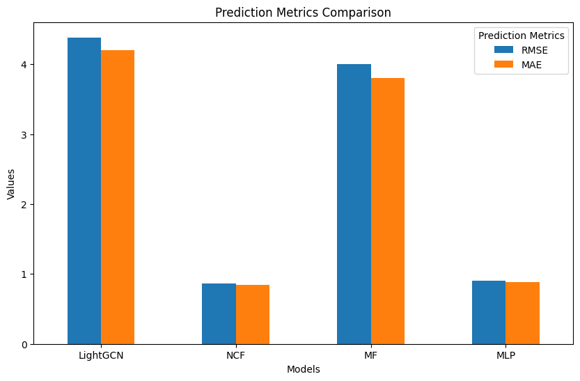
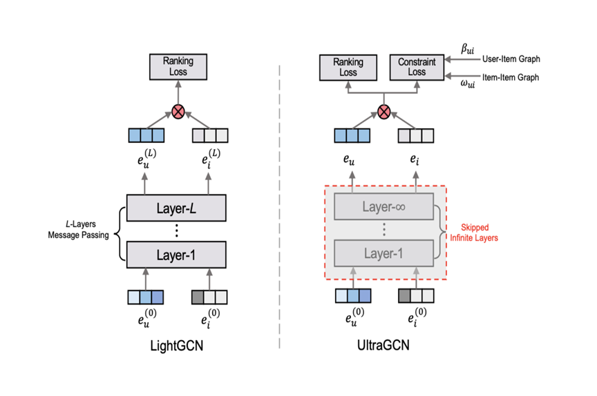
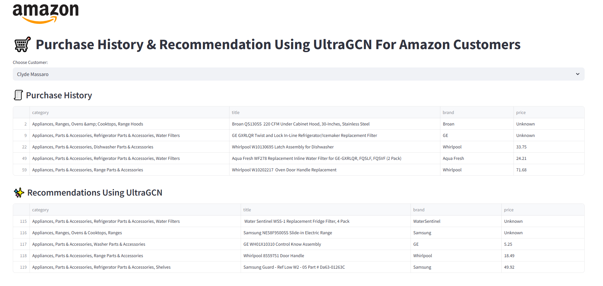

# 🛒 Product Recommendation System for E-commerce Platform 

This is a project using deep learning-based recommendation system designed to enhance user experience by suggesting relevant products for e-commerce platforms.

   
  <em>Source pic: <a href="https://www.leewayhertz.com/" target="_blank">leewayhertz.com</a></em>

---
## 👥 Contributors

| Student ID  | Name                  | 
|-------------|-----------------------|
| 21280125    | Trần Thị Uyên Nhi    |
| 21280084    | Đặng Thị Kim Anh     |
| 21280109    | Phan Huy Thịnh       |

---

## 📌 1. Overview
This project focuses on building a **batch processing pipeline** for training and deploying product recommendation models based on **user behavior data** from the **Amazon Appliance Dataset**.

**Key Features:**
- Data preprocessing & feature engineering.
- Model training and evaluation with multiple recommendation algorithms.
- Top-K product recommendations for given users.
- Visualization and analysis of user-product interactions.

---

## 📊 2. Dataset
- **Source:** [Amazon Appliance Dataset (UCSD)](https://nijianmo.github.io/amazon/index.html)
- Includes:
  - `Appliances.json` (reviews)
  - `meta_Appliances.json` (metadata)

---

## 🔍 3. Data Pipeline
**Main Flow:**  
`Data Extraction → Preprocessing → Model Training → Evaluation → Deployment`

**Visualization & EDA:**  
- Histograms, Pie Charts, Word Cloud
- Rating distribution, interaction density

---

## 🧠 4. Models Implemented
- **Matrix Factorization (MF)**  
  Decomposes the user–item interaction matrix into latent factors to capture preferences and product features efficiently.

- **Neural Collaborative Filtering (NCF)**  
  Replaces the dot-product in MF with a neural network to model complex user–item interactions.

- **Multi-Layer Perceptron (MLP)**  
  Learns non-linear relationships between user and item embeddings using multiple fully connected layers.

- **LightGCN**  
  A graph-based recommendation model that propagates embeddings through user–item interaction graphs for improved accuracy.

---

## 📈 5. Evaluation Metrics

- **Precision@K**  
  Measures the proportion of relevant items in the top-K recommended list compared to all recommended items.

- **Recall@K**  
  Indicates how many of the relevant items are included in the top-K recommendations out of all relevant items for a user.

- **F1-Score**  
  Harmonic mean of Precision and Recall, balancing both accuracy and coverage.

- **NDCG@K (Normalized Discounted Cumulative Gain)**  
  Evaluates ranking quality by considering both the relevance and the position of items in the top-K list.

- **RMSE (Root Mean Square Error)**  
  Measures the square root of the average squared differences between predicted and actual ratings (lower is better).

- **MAE (Mean Absolute Error)**  
  Calculates the average absolute difference between predicted and actual ratings, giving a more interpretable error metric.

   
  <em>Model Comparison using Precision@10, Recall@10, NDCG@10</em>

   
  <em>Model Comparison using RMSE & MAE</em>

**Conclusion:**

The experiments demonstrate that **LightGCN** is the most suitable model for top-N recommendations in e-commerce platforms, achieving superior ranking metrics (Precision@10, Recall@10, NDCG@10) by leveraging graph structure, while outperforming both traditional models (MF) and other deep learning approaches (NCF, MLP).

---
## 🔍 6. Model Improvement: LightGCN vs UltraGCN

- To enhance recommendation performance, we compared **LightGCN** with **UltraGCN**:

| Aspect               | LightGCN                                  | UltraGCN                                              |
|----------------------|-------------------------------------------|------------------------------------------------------|
| Message Passing      | Multi-layer propagation (costly)         | Removed (simplifies computation)                    |
| Global Similarity    | Not considered                           | Added for better embedding quality                  |
| Efficiency           | Higher computation cost                  | Lower cost, faster training                         |
| Performance Metrics  | Good                                     | Improved Precision@K, Recall@K, NDCG, and RMSE/MAE  |

   
  <em>Architecture and concept difference between LightGCN and UltraGCN</em>

- Performance Comparison (LightGCN vs UltraGCN)

| Model      | Precision@10 | Recall@10 | NDCG@10 |   RMSE   |   MAE   |
|-----------|--------------|-----------|---------|----------|---------|
| LightGCN  | 0.0042       | 0.0370    | 0.0355  | 4.3841   | 4.2028  |
| **UltraGCN**  | **0.0056**       | **0.0412**    | **0.0389**  | **4.2217**   | **4.1059**  |

**Conclusion:**  

UltraGCN outperforms LightGCN across ranking metrics (Precision@10, Recall@10, NDCG@10) and reduces RMSE/MAE, resulting in higher-quality embeddings. With lower computational cost and simpler architecture, UltraGCN proves superior in both accuracy and practical deployment.

---
## 🚀 7. Features
- Enter customer name → Get **Top 5 product recommendations** using UltraGCN.
- Display user interaction history.
- Compare predicted vs actual interactions.

   
  <em>Prodcuct Demo</em>

---

## 🏗️ Tech Stack
- **Python**, **Pandas**, **NumPy**, **Matplotlib**, **Seaborn**
- **PyTorch** (for Deep Learning models)
- **Scikit-learn**
- **Visual Studio Code** and **Google Colab** for training

---
## ▶️ Usage
- **Step 1**: Download Product_Demo on Repository
- **Step 2**: Open and run **Recommend_Using_UltraGCN.ipynb**, you can customize the random number of users you want to output using `selected_users = random.sample(list(valid_users), random_numbers)` on section 4, UltraGCN will still learn from all of data.
- **Step 3**: After that, you can see it ouput two files: purchase_history.csv and recommendations.csv.
- **Step 4**: Open command prompt (Administrator)
- **Step 5**: Navigate to the Product_Demo folder that you downloaded using the `cd` command.
- **Step 6**: Then run `streamlit run Demo_web.py` (Make sure you install streamlit first).
- **Step 7**: Enjoy 🎉

The demo output will be a website similar to "**🚀 7. Features**", where you can select a customer to display the list of customers who have made purchases and recommend the next product for the customer.
